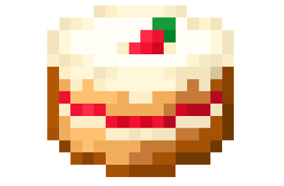

# 🐍 Snake-Game

 

A nostalgic **Snake game** in Python, inspired by the classic Nokia version, with sound effects and customizable skins.  

---

## 🎮 Overview

- 🟩 Playable snake moving across a grid  
- 🍎 Collect food to grow and increase your score  
- ❌ Avoid walls and your own tail — game ends on collision  
- 🎨 Customizable visuals and sounds  

---

## 🕹 How to Play

- Run `snakegamemain.py` to start the game  
- Eat food to grow; avoid collisions  
- Press `Esc` or `Q` to quit  

---

## 🎛 Controls

| Key        | Action                          |
|------------|---------------------------------|
| Arrow Keys | Move the snake in four directions |
| Esc / Q    | Quit the game                   |

---

## 🖼 Screenshot

 
*(Replace `screenshot.png` with an actual screenshot of the game)*

---

## 📦 Assets

### Snake Skin

### Background

### Food

### Sounds
- [Food Eating Sound](food_eat.wav)  
- [Game Over Sound](game_over.wav)  

---

## ⚙️ Customizing

- 🎨 Replace PNG files to change snake, background, or food skins  
- 🔊 Swap `.wav` files for custom sound effects  
- 🖌 Modify colors, speeds, or grid size in `snakegamemain.py`

